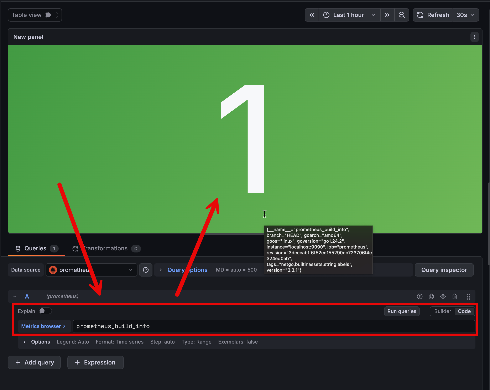

---
lab:
    title: 'สร้าง Dashboard แรกด้วย PromQL และ Panel พื้นฐานใน Grafana'
    description: 'ผู้เรียนจะสร้าง Dashboard จาก Prometheus metrics และปรับแต่ง Panel แบบ Time series กับ Stat'
    topic: 'Queries and Panels'
    level: 200
    duration: 45
    islab: true
---

# สร้าง Dashboard แรกด้วย PromQL และ Panel พื้นฐานใน Grafana

ใน exercise นี้ เราจะใช้ Prometheus เป็นแหล่งข้อมูลหลักเพื่อสร้าง Dashboard แรกใน Grafana โดยเริ่มจาก dashboard skeleton ที่เตรียมไว้ แล้วเพิ่ม Panel แบบ Time series และ Stat พร้อมทั้งเขียน PromQL ให้ตรงกับคำถามทางธุรกิจที่ต้องการตอบ

This exercise takes approximately **45** minutes.

## Learning Objectives

1. เปิด stack สำหรับการสร้าง Dashboard ใน GitHub Codespaces
2. นำเข้า dashboard skeleton สำหรับ lab
3. สร้าง Panel แบบ Time series และ Stat จาก Prometheus metrics
4. ปรับแต่งชื่อ panel, legend, และมุมมองให้ dashboard อ่านง่ายขึ้น

## Prerequisites

- ทำ exercise 02 หรือเข้าใจการเพิ่ม Prometheus Data source แล้ว
- ใช้งาน Grafana UI และหน้า **Explore** เบื้องต้นได้
- เข้าใจ PromQL ขั้นพื้นฐาน

## Scenario

ทีม platform ต้องการ dashboard สั้น ๆ สำหรับตรวจสอบว่าส่วนประกอบหลักของ monitoring stack ยังทำงานอยู่หรือไม่ โดยต้องมีทั้งกราฟเชิงเวลาและค่าปัจจุบันแบบอ่านเร็ว ผู้เรียนจึงต้องสร้าง dashboard ที่ตอบคำถามได้ทันทีว่า target ยัง `up` อยู่ไหม และเวอร์ชันของ Prometheus ที่กำลังรันคืออะไร

---

## เปิด environment สำหรับ dashboard lab

1. เปิด Terminal แล้วไปที่โฟลเดอร์ lab นี้

   ```bash
   cd labfiles/04-queries-and-panels
   ```

1. รัน stack ของ Grafana และ Prometheus

   ```bash
   docker compose up -d
   ```

1. เปิด Grafana ผ่าน port `3000` แล้ว login ด้วย `admin` / `grafanaadmin`

1. หากยังไม่มี Prometheus Data source ให้เพิ่มใหม่ด้วย URL `http://prometheus:9090`

## นำเข้า dashboard skeleton

1. ไปที่ **Dashboards** > **New** > **Import**

1. เลือกไฟล์ `dashboards/starter.json` จากโฟลเดอร์ lab นี้

1. ตั้งชื่อ dashboard ใหม่เป็น `Platform Health Overview`

1. คลิก **Import**


## สร้าง Time series panel

1. ใน dashboard ที่เพิ่ง import ให้คลิกปุ่ม **Edit** ที่มุมบนขวาเพื่อเข้าสู่ edit mode

1. คลิกปุ่ม **Add new element** (ไอคอน "+" สีน้ำเงิน) ในแถบ toolbar

1. panel ใหม่จะปรากฏบน canvas ให้คลิกที่ panel นั้น แล้วเลือก **Configure visualization**

1. ในหน้า panel editor ให้คลิกแท็บ **Queries** ด้านล่าง จากนั้นคลิก dropdown ของ Data source แล้วเลือก **Prometheus**

1. ในช่อง query ด้านขวา ให้คลิกปุ่ม **Code** เพื่อสลับเป็น code mode แล้วพิมพ์ query ต่อไปนี้

   ```promql
   up{job="prometheus"}
   ```

1. คลิก **Run Query** เพื่อทดสอบดึงข้อมูล จากนั้นดูที่ส่วน visualization suggestions ด้านขวา ให้เลือก **Time series** (ตัวแรกในรายการ) — Grafana จะแสดง properties pane ของ panel ขึ้นมา

1. ตรวจสอบว่า panel แสดงค่า `1` ตลอดช่วงเวลา แปลว่า target ยังตอบสนองปกติ

1. ในแผง properties ด้านขวา ให้ขยาย **Panel options** แล้วกรอกชื่อ panel ในช่อง **Title** ว่า `Prometheus Availability`

1. กลับไปที่แท็บ **Queries** ในส่วนด้านล่างของหน้า panel editor ให้มองหา **Legend** ที่อยู่ใต้ช่อง PromQL จากนั้นเปลี่ยน option เป็น **Custom** แล้วกรอก

   ```
   {{instance}}
   ```
กดปุ่ม enter เพื่อยืนยันการเปลี่ยนแปลง จากนั้นสังเกตว่า legend ของเส้นในกราฟเปลี่ยนจากค่า `instance` เป็นค่าที่แทนที่ตัวแปรนี้ เช่น `localhost:9090` 

## สร้าง Stat panel สำหรับ metadata

1. คลิกปุ่ม **Add new element** อีกครั้ง แล้วคลิก panel ใหม่บน canvas จากนั้นเลือก **Configure visualization**

1. ใช้ query ต่อไปนี้

   ```promql
   prometheus_build_info
   ```

1. เลือก visualization เป็น **Stat**

1. ตั้งชื่อ panel เป็น `Prometheus Build Info`

 ค่า metric นี้ใช้ยืนยัน metadata ของ binary ที่กำลังรันอยู่ ไม่ได้ใช้วัดโหลดแบบ time series ทั่วไป



## จัดหน้า dashboard และบันทึก

1. จัดวาง Time series panel และ Stat panel ให้อยู่ใน layout ที่อ่านง่าย

1. คลิก **Save dashboard**

1. ใส่คำอธิบายสั้น ๆ เช่น `Starter dashboard for platform health checks`

การเลือก panel ให้เหมาะกับคำถามสำคัญพอ ๆ กับการเขียน query ให้ถูกต้อง

## ผลลัพธ์

เราควรมี dashboard แรกที่ประกอบด้วยอย่างน้อยหนึ่ง Time series panel และหนึ่ง Stat panel ซึ่งดึงข้อมูลจาก Prometheus ได้จริง

## เตรียม environment สำหรับ exercise ถัดไป

1. กลับมาที่โฟลเดอร์ของ lab นี้

   ```bash
   cd labfiles/04-queries-and-panels
   ```

1. หยุด stack ของ Grafana และ Prometheus

   ```bash
   docker compose down
   ```

1. ตรวจสอบอย่างเร็วว่าไม่มี container ค้างจาก lab นี้ เพื่อให้ dashboard และ port จาก exercise นี้ไม่รบกวน exercise ถัดไป